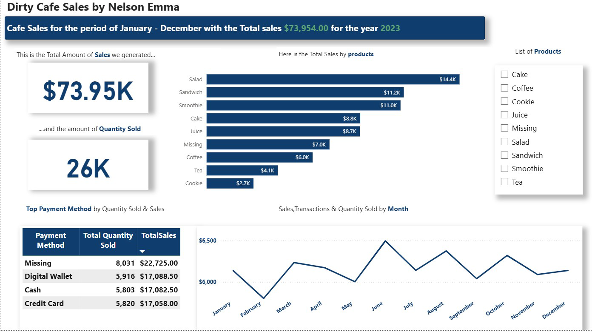

# Dirty Cafe Sales Dashboard

## 📊 Project Overview
This project explores a year's worth of sales data from a cafe (January – December 2023).  
The goal was to analyze sales performance, identify top products, understand customer payment preferences, and highlight areas where data quality issues exist.  
I built an interactive dashboard in **Power BI** to present the findings.

---

## 🛠 Tools Used
- Power BI (data visualization & dashboarding)
- Excel (data cleaning & preparation)
- DAX (for calculated measures)

---

## 🔑 Key Insights
- **Total Sales:** $73.95K generated across 26K items sold.  
- **Top Product:** Salad was the highest revenue generator at $14.4K.  
- **Payment Methods:** "Missing" values category had the largest share of sales ($22.7K), showing a data quality issue that needs further investigation.  
- **Sales Trend:** Peak sales occurred in June, with noticeable fluctuations throughout the year.  

---

## 📂 Files in this Repository
- `cafe_sales.pbix` → Power BI dashboard file  
- `dashboard.png` → Screenshot of the dashboard  
- `cafe_sales.csv` → Dataset used 
- `README.md` → Project documentation (this file)  

---

## 📸 Dashboard Preview

---

## 🚀 How to Use
1. Download the `cafe_sales.pbix` file.  
2. Open it in **Power BI Desktop**.  
3. Ex
